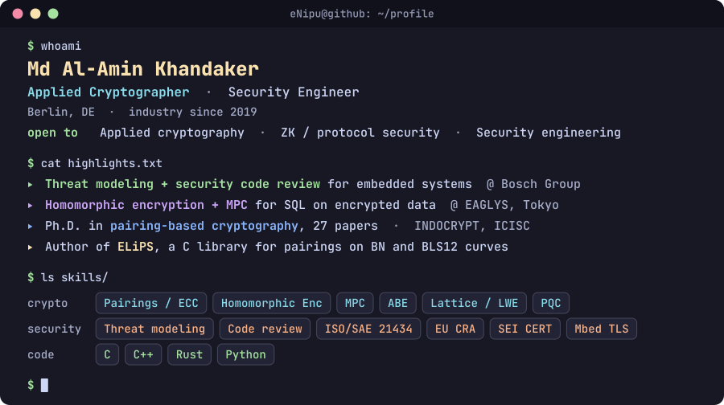

 

&nbsp;

&nbsp;

## About

Applied cryptographer and security engineer in Berlin, in industry since 2019.

- **Now:** threat modeling and security code review at ITK Engineering (Bosch Group).
- **Before:** homomorphic encryption and MPC for SQL on encrypted data at EAGLYS, Tokyo. Made encryption and decryption 17x faster.
- **Ph.D.:** fast pairing computation on elliptic curves. 27 publications.

## Selected work

- [**ELiPS**](https://github.com/eNipu/elips_bn_bls) (early version): pairing library in C for BN and BLS12 curves
- [**Computing on Secrets**](https://al-am.in/writing): LWE, Ring-LWE and BFV homomorphic encryption, built from scratch
- [**Efficient Optimal Ate Pairing at 128-Bit Security Level**](https://eprint.iacr.org/2017/1174): INDOCRYPT 2017
- [**Solving 114-Bit ECDLP for a Barreto-Naehrig Curve**](https://doi.org/10.1007/978-3-319-78556-1_13): ICISC 2017, a record at the time

## Open to

Applied cryptography, ZK and protocol security, and security engineering roles. Berlin or remote. German permanent residence, no visa sponsorship needed.
